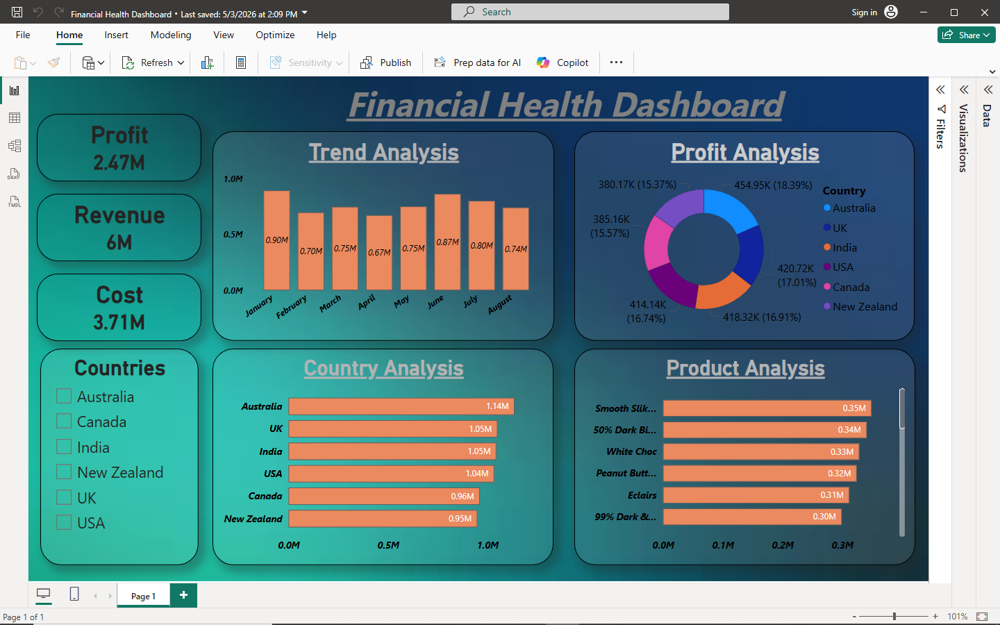

# 📊 Financial Health Analytics Dashboard

## 📌 Overview
This project is an interactive Power BI dashboard designed to analyze financial performance across different dimensions such as revenue, profit, cost, and trends.

---

## 🎯 Key Features
- 💰 Revenue, Profit & Cost Analysis
- 📈 Monthly Trend Analysis
- 🌍 Country-wise Performance Insights
- 📦 Product-level Analysis
- 📊 Interactive Filters & Visualizations

---

## 🔍 Key Insights
- Revenue trends show fluctuations across months
- Certain countries contribute higher revenue
- Product performance varies significantly
- Cost management directly impacts profit

---

## 🛠 Tools & Technologies
- Power BI  
- DAX  
- Data Visualization  

---

## 📂 Files Included
- Financial Health Dashboard.pbix  
- Dashboard.png (Preview)

---

## 📸 Dashboard Preview

---

## 🚀 Author
**Raj Kesharwani**
